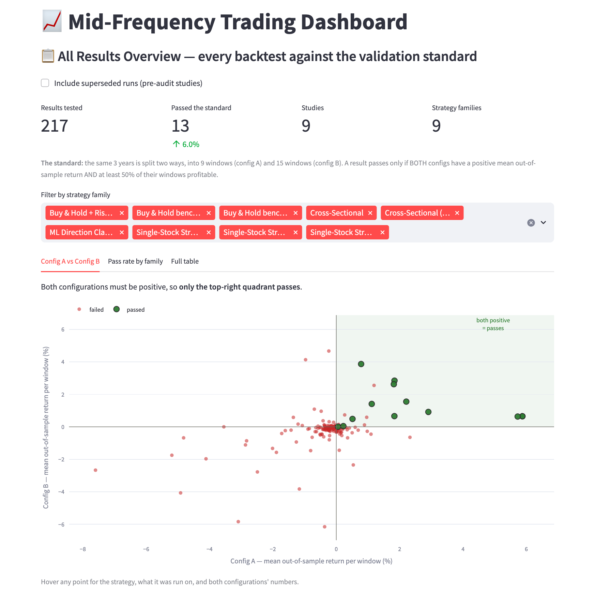
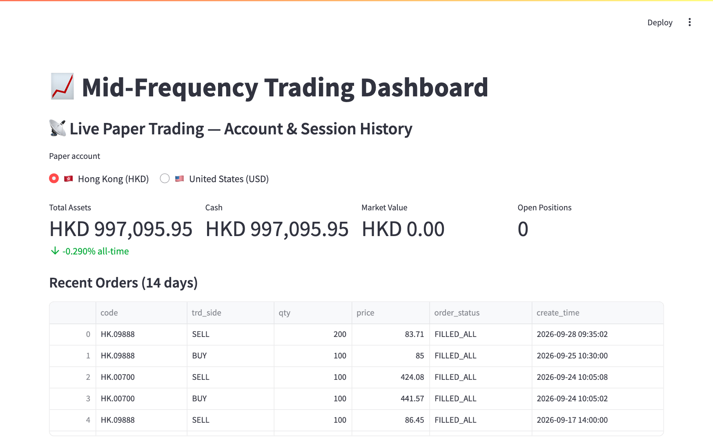
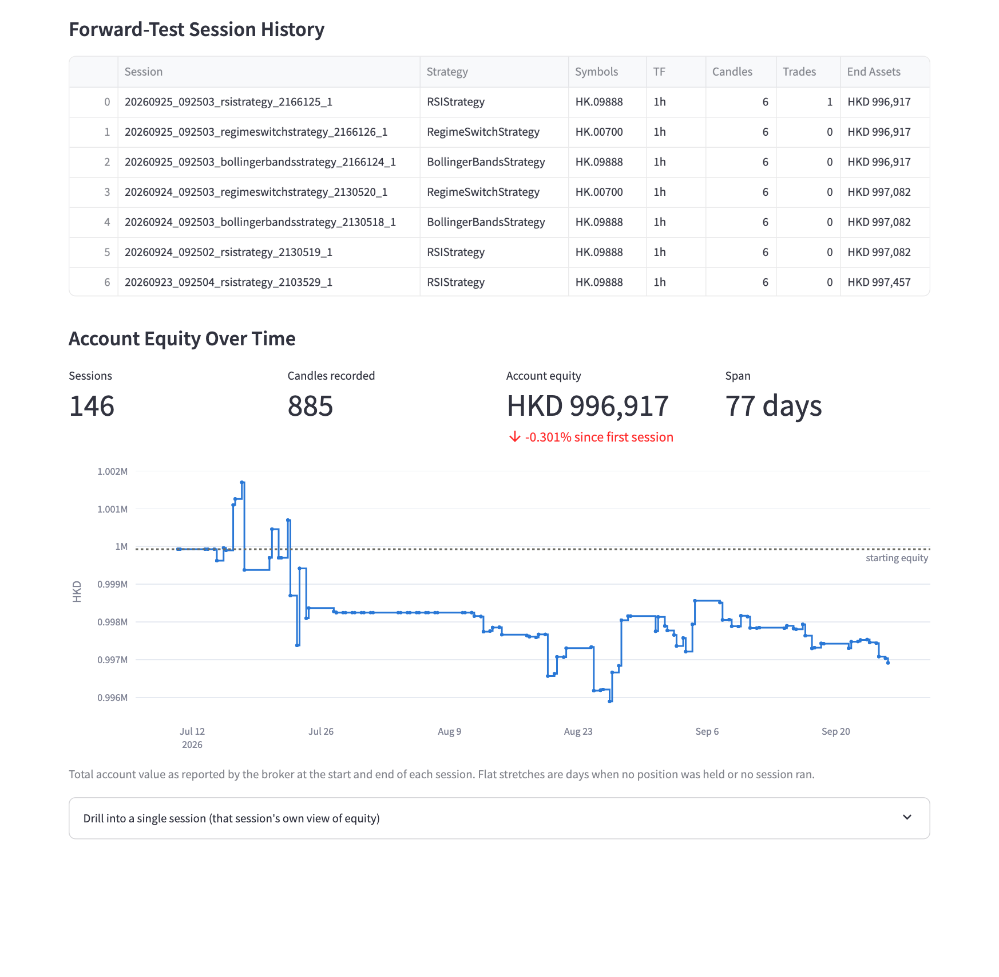
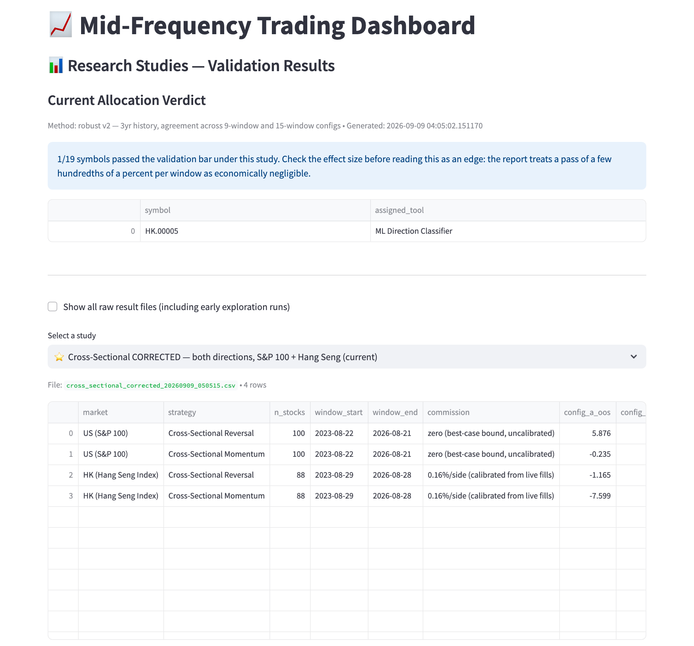

# Dashboard Guide

The dashboard is the interactive front end to this project: it runs backtests and walk-forward
optimisations, shows the live paper-trading accounts, and lays out every research result.
No code needs to be touched to use it.

## Starting it

```bash
git pull                                   # latest code and live-session logs
PYTHONPATH=src streamlit run src/app.py    # opens http://localhost:8501
```

The **Live** view needs the moomoo OpenD gateway running and logged in on port 11111 to show
account balances. Without it, that view still shows recorded session history, and every other
view works normally.

## Layout

- **Sidebar (left):** the controls — what to test and how.
- **Main area:** the results of whichever view was last opened.
- The **buttons at the foot of the sidebar** choose the view. Changing a setting does not re-run
  anything; press the button again.

## The views

| Button | What it does |
|---|---|
| 🚀 **Run Backtest** | One strategy over one period: price chart with indicators, equity curve against buy-and-hold, and the full trade log. |
| ⚡ **Compare All Strategies** | Every strategy on the selected stock with default settings, side by side. |
| 🔬 **Run Optimization** | Grid search, or walk-forward — the validation method used throughout the project. |
| **Show Live Account & Sessions** | Either paper account (HK or US), its positions and orders, session history, and account equity over the whole deployment. |
| 📋 **All Results Overview** | Every result brought to the validation standard, on one chart. |
| **Browse Research Results** | The raw results file of any individual study. |

### All Results Overview — the best place to start



Each dot is one strategy tested on one stock or universe. The horizontal axis is its average
out-of-sample return under the 9-window split (Config A), the vertical axis under the 15-window
split (Config B). **A result passes only if both are positive and at least half of its windows
are profitable, so only the shaded top-right quadrant can pass.** Hover over any dot for the
details; the *Pass rate by family* tab summarises by strategy type.

### Live paper trading



The selector at the top switches between the **Hong Kong** account (HKD) and the **US** account
(USD). The S&P 100 forward test trades the US account, capped at US$100,000.



The equity curve uses the account value reported by the broker at the start and end of each
session. Session logs are recorded on the cloud VM and uploaded daily at 16:15 SGT, so run
`git pull` to see the latest.

### Research studies



Studies are listed current-first. Anything marked *superseded* was produced before the
2026-09-08 audit corrected six defects in the testing code and should not be relied on.

## Sidebar controls

1. **Universe** — HK live roster (19), US 15 large caps, S&P 100, or Hang Seng Index (88). Sets
   the currency and the default commission.
2. **Symbol** — the stock, for single-stock strategies.
3. **Strategy** and its parameters.
4. **Timeframe** — keep **1 Hour**; all studies use hourly data, which exists for every symbol.
5. **Start / End date** and **Starting capital**.
6. **Risk Management** — stop-loss, trailing stop, take-profit, position sizing, drawdown halt.
7. **Execution Model** — slippage and **commission per side** (HK 0.160%, US 0.005% by default).
8. **Strategy Optimization** — grid search or walk-forward, number of windows, train fraction,
   and the objective (Sharpe ratio by default).

**Cross-sectional strategies** (reversal and momentum) rank stocks against each other, so they
always run on the **whole selected universe**, not just the chosen symbol, with money split
equally across the stocks held. A note appears above the results when this happens.

## Things to try

1. **A single-stock backtest.** Universe *US — S&P 100*, symbol *US.AAPL*, strategy
   *Z-Score Mean Reversion*, then **Run Backtest**.
2. **The project's headline strategy.** Same universe, strategy *Cross-Sectional Reversal*, then
   **Run Backtest**. It trades across all 100 stocks.
3. **Cost sensitivity.** Repeat step 2 with *Commission per side* raised from 0.005 to 0.160
   and compare.
4. **A walk-forward validation.** Universe *US — 15 large caps*, strategy *Cross-Sectional
   Reversal*, *Walk-Forward* mode, then **Run Optimization** (1–2 minutes).
5. **The whole record.** Open **All Results Overview**.

## Reading a single backtest

A single backtest over one period, with parameters that were never validated, is not evidence
of an edge. A profitable-looking backtest is easy to find by trying settings until one works.
That is why this project requires agreement across two walk-forward splits, and why the one
result that passed was then tested further (report §4.11): after correcting for the number of
strategy-universe combinations tried, it could not be distinguished from chance.

## Timing

| Action | Typical time |
|---|---|
| Backtest, single stock | ~1 s |
| Backtest, cross-sectional on the S&P 100 | ~5 s |
| Walk-forward, cross-sectional on US 15 / HK 19 | 1–2 min |
| Walk-forward, cross-sectional on the S&P 100 / Hang Seng | 10–15 min |
